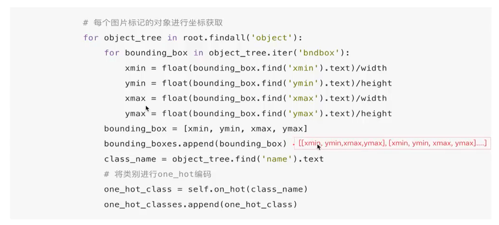

# 1.项目训练介绍

* ckpt：分为预训练和微调模型
* datasets：放训练原始数据以及存储数据、读取数据代码以及模型priorbox
* servingmodel：模型部署使用的模型位置
* export_serving_model：导出TFserving指定模型类型
* train_ssd：训练模型代码逻辑

## 1.1 xml读取本地文件存储到pkl

* ElemenTree工具使用，解析xml结构

* 保存物体坐标结果以及类别

  * pickle工具导出

* 保存的信息：

  ```xml
  	<object>
  		<name>0</name>
  		<bndbox>
  			<xmin>261</xmin>
  			<ymin>642</ymin>
  			<xmax>1919</xmax>
  			<ymax>1078</ymax>
  		</bndbox>
  	</object>
  ```

* 

* x/width

  y/height

  ------> 保存归一化的结果