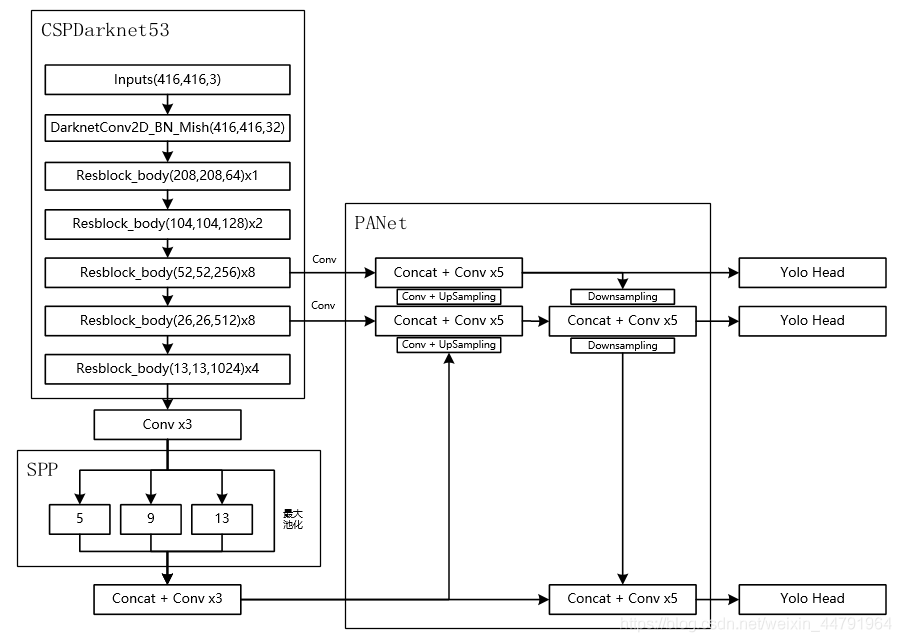

# CSPDarknet

理解：

* CSPDarknet主干部分
  * 输入图片 416 * 416 * 3
  * 首先卷积成 32个channel
  * 再经过五次Resblock_body（残差网络构成的大卷积块），高和宽不断压缩，通道数不断扩增。其中后三次最为重要为三个有效特征层。，后边的 × 几 是 残差块堆叠次数。
    * 将52 * 52 * 256的特征层记为 1。
    * 将26 * 26 * 256的特征层记为 2。
    * 将13 * 13 * 256的特征层记为 3。
    * 3 经过三次卷积+SPP池化+三次卷积  上采样成26 * 26与 2 特征融合成 26 * 26（2‘）
    * 2'采样为 52 * 52 后 与 1 特征融合成 1’ 。
    * 此时。1‘ 再 进行下采样成 26 * 26 后 与 2’ 特征融合，后又经过下采样成 13 * 13 与 3 进行特征融合。

# 先验框 与 yolobody

1. pytorch中 通道数 在 batch_size 后面

# 预测过程

1. 对图片进行不失真的resize（加灰条）
2. 归一化  /255
3. 转换成torch
4. 传入网络并获得预测结果
5. 对结果进行解码
6. 非极大性抑制
7. 调整（6获得的框是有灰条时的框）
8. 绘制

# 训练过程

1. 准备好数据集 voc
   1. 文件夹分为三个，依次是 Annotations（xml）、ImageSets（train.txt->图片文件名字，）、JPEGImages（图片文件）
   2. 修改 ~~voc_annotation.py~~   /model_data/voc_classes.txt里的 classes为自己想要训练的类别
   3. 修改 要保存到的 pth模型位置
   4. 训练

# 用自己的模型预测

1. 修改pth位置
2. 修改voc_classes.txt
3. 输入图片名/位置，预测