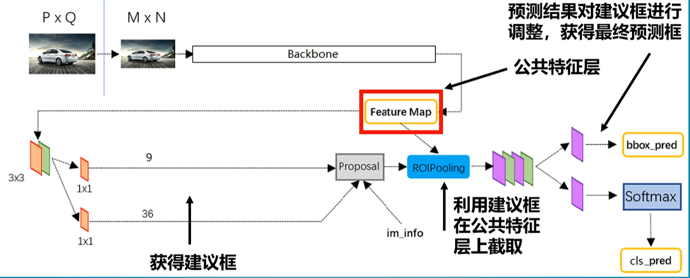

# 1.Faster R-CNN

1. 一张图片传入FasterRCNN中，首先resize到600×800的shape，为防止失真，长宽比保持不变，获得一个38×50的特征层。

2. 利用RPN区域建议网络，获得先验框的调整参数，及先验框中是否包含物体，此时便获得了建议框，然后在特征层上进行截取，截取的不同特征层就能反应原图上的不同位置。

3. 建议框大小并不是一样的，所以截取到的局部特征层也是不一样的，截取的内容传入ROI pooling层中，分区域的池化，将截取的不同大小的特征层区域resize到**一样大小**。

4. 然后利用分类与回归网络 判断（建议框下）截取到的图片中是否包含目标，并对建议框进行调整，调整后的结果就是整体的预测结果。

   

5. Backbone里用 xxx Net / VGG 或者其他主干特征提取网络

6. 9个先验框

7. 两个1×1卷积的结果 就是判断 先验框内部是否真实地包含物体。

8. 18就是 9×2 ， 就是用来判断 先验框内部是否真实包含物体，其中2，一个代表先验框是背景的概率，另一个代表先验框内部有物体的概率。 36就是 9×4 ，其中的 4，就是先验框的调整参数

9. 双阶段-粗略的筛选（建议框）和细致的调整（ROI Pooling）

## 1.2ResNet50

### 1.2.1

# 2.1×1卷积

# 3.Relu

# 4.Densenet

