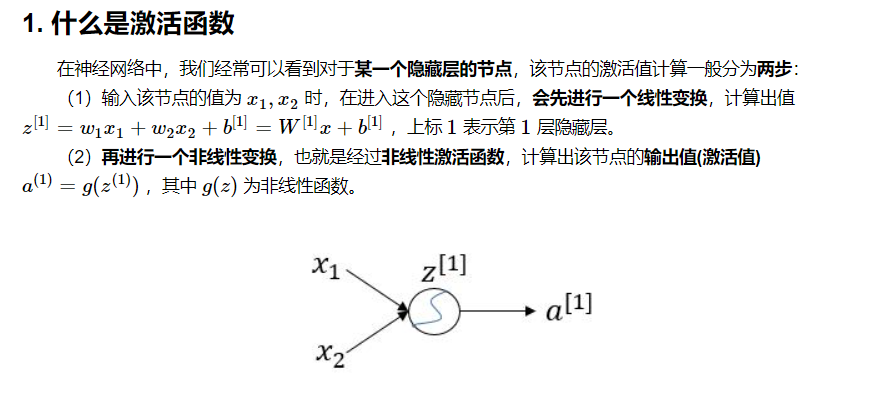
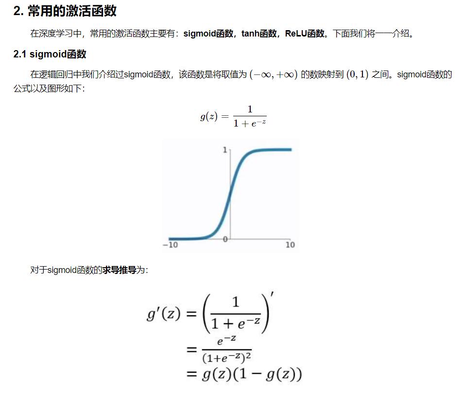
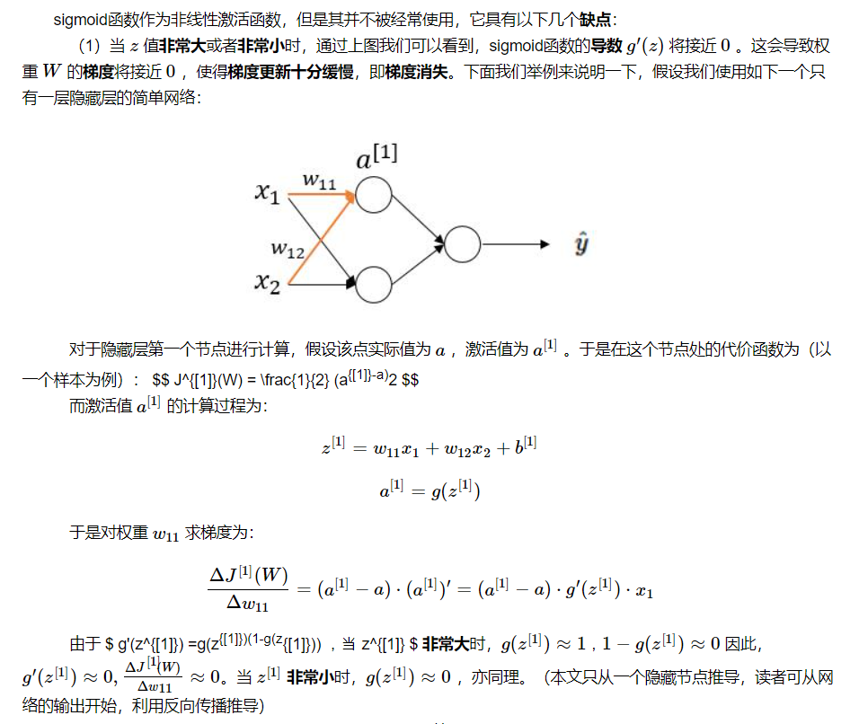
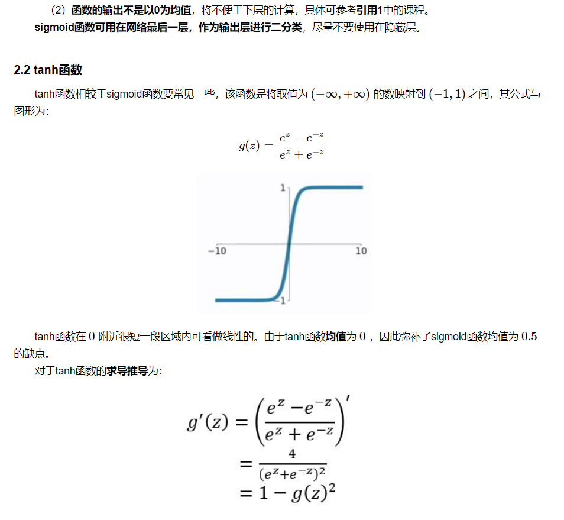
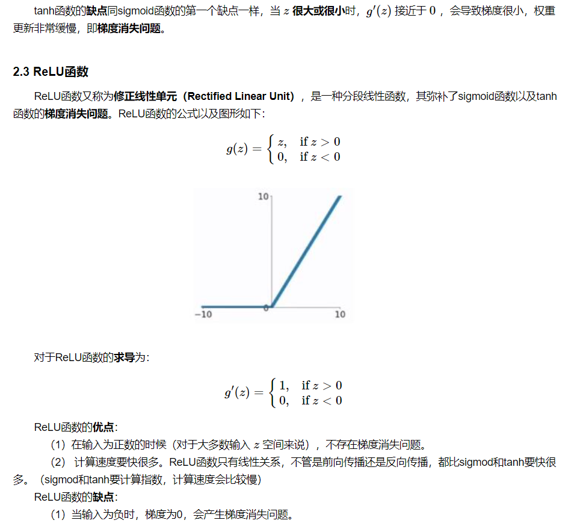
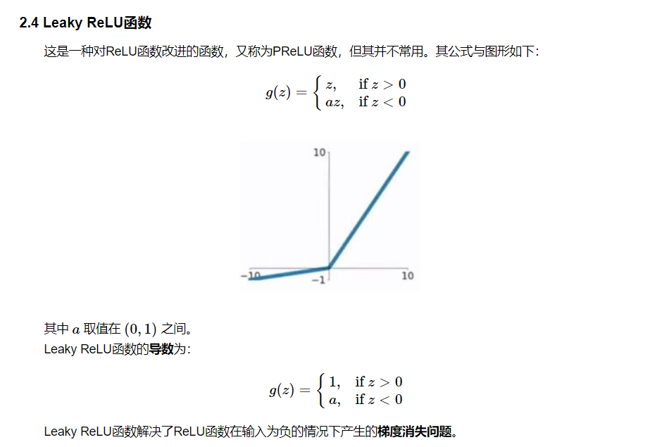
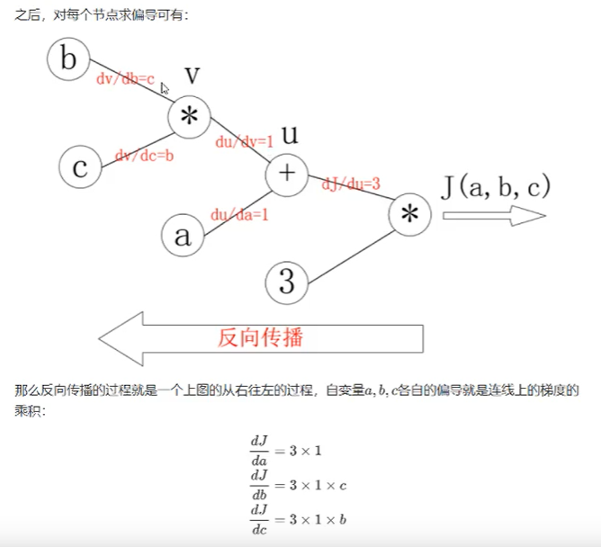

# 1深度学习

1. 机器学习的分支。人工神经网络 为基础，对数据的特征进行学习的方法。
2. 机器学习与深度学习的区别
   1. 特征抽取
      1. 机器学习需要人工的特征抽取的过程
      2. 深度学习：自动的进行特征抽取，
   2. 数据量
      1. 机器学习：数据少，效果不是特别好
      2. 深度学习：数据多，效果更好
   3. 应用场景
      1. 图像识别
      2. 自然语言处理技术
      3. 语音技术
   4. 框架

# 2神经网络

1. 概念
   1. 模拟生物的神经系统，对函数 进行估计或近似  
2. 神经元
   1. 神经网络中的基础单元，相互连接，组成神经网络
   2. 。
   3. 一个神经元的功能是求得输入向量与权向量的内积后，经一个非线性传递函数得到一个标量结果。
3. 单层神经网络
   1. 最简单的神经网络的形式
4. 感知机
   1. 两层神经网络（输入，输出）
   2. 简单的二分类的模型，给定阙值，判断数据属于哪一部分
5. 多层神经网络
   1. 输入层
   2. 输出层
   3. 隐层：可以有多层，每一层神经元个数可以不确定
   4. 全连接层：第N层和第N-1层中神经元两两之间都有链接
      1. 进行的是y = Wx+b
6. 激活函数
   1. 
   2. 
   3. 
   4. 线性
      1. 系统：函数，f，模型，f(x)=y，
      2. f(x1+x2) = y1+y2
      3. f(kx1) = ky1  满足这两个条件 为线性
   5. 作用：
      1. 增加模型的非线性分割能力
      2. 提供魔性的稳健性
      3. 缓解梯度消失
      4. 加速模型的收敛
   6. 常见激活函数：
      1. sigmoid：（0,1）
      2. tanh：（-1,1）
      3. relu： max（0，x）
      4. ELU： a(e^x-1)

# pytorch

1. 安装

2. Tensor
   1. 各种数值数据成为张量
   2. 常数：scaler：0阶张量
   3. 向量：vector：1阶张量
   4. 矩阵：matrix：2阶张量
   5. 3阶张量
   
3. 张量的创建方法
   1. torch.Tensor(list)
   2. torch.randint(low=3,high=10,size=(3,4))
   3. torch.rand()/randn()
   4. torch.empty()/zero()/ones()
   
4. 张量的方法和属性

   1. t1 = torch.Tensor([[[1]]])  -------   `t1.item()` # 1.0   item() 数据中只有一个元素的时候，取值

   2. torsor numpy()转化 为numpy 数组

   3. tensor.size()获取形状

      1. ```python
         >>x
             tensor([[1, 2]
                     [3, 4]
                     [5,10]],dtype=torch.int32)
         
         >>x.size()
         	torch.size([3,2])
         	
         >>x.size(1) # 获取某一阶的形状，获取第一维度的形状
         ```

   4. tensor view() 浅拷贝，`tensor.view([shape])`仅仅形状的变化，类似numpy的reshape.

      1. `tensor.view()`方法可以调整tensor的形状，但必须保证调整前后元素总数一致。view不会修改自身的数据，返回的新tensor与原tensor共享内存，即更改一个，另一个也随之改变。

      2. ```python
         import torch as t
         a = t.arange(0,6).view(2,3)
         print(a)
          
         b=a.view(-1,2)  #当某一维是-1时，会自动计算它的大小
         print(b)
          
         #输出
         tensor([[0, 1, 2],
                 [3, 4, 5]])
         tensor([[0, 1],
                 [2, 3],
                 [4, 5]])
         ```

      3. 如果 ` t1.view(-1)`并且，torch.size([1,1,2])  1 * 1 * 2 = 2,则此处的-1代表2

      4. ```python
         >>t2 = torch.Tensor([[[1,2]]])
         >>t2
         	tensor([[[1.,2.]]])
         
         >>t2.size()
         	torch.Size([1,1,2])  # 1*1*2=2
             
         >>t2.view([-1])          # 此时的-1代表2，因为1*1*2=2
         	tensor([1.,2.])
             
         >>t2.view([2,-1])        # 此时第一个参数2代表 第一个维度的大小设定为2，后一个-1，就是说第二个维度的大小 = 元素总数目/第一个维度的大小，此例中，2/2=1
         	tensor([[1.],
                     [2.]])
         >>t2
         	tensor([[[1.,2.]]]) # 原来的t2不变
         ```

      5. 获取阶数：`tensor.dim()`

      6. 获取最大值：`tensor.max()`

         1. 获取最小值：`tensor.min()`

      7. 转置：`tensor.t()`

         1. 二维：`tensor.transpose(0,1)`
         2. 高维：`tensor.transpose(0,1)`  或 t3.permute(0,2,1)

         ```python
         >>t3 = torch.Tensor(numpy.arange(24).reshape(2,3,4)) # 类似view，2*3*4=24 一共有两块，每一块3行四列
         >>t3
         	tensor([[[ 0.,  1.,  2.,  3.],
                      [ 4.,  5.,  6.,  7.],
                      [ 8.,  9., 10., 11.]],
         
                     [[12., 13., 14., 15.],
                      [16., 17., 18., 19.],
                      [20., 21., 22., 23.]]])
         >>t3.size()
         	torch.Size([2, 3, 4])
         >>t3.transpose(0,1) # 0代表2,1代表3
         	tensor([[[ 0.,  1.,  2.,  3.],# 转置后
                      [12., 13., 14., 15.]],
         
                     [[ 4.,  5.,  6.,  7.],
                      [16., 17., 18., 19.]],
         
                     [[ 8.,  9., 10., 11.],
                      [20., 21., 22., 23.]]])
             
         >>t3.permute() #与transpose不同的是，permute要传三个值。
         >>t3.permute(0,1,2) #正常情况，什么都不变这么写
         
         >>t3.permute(1,0,2) # 等同于 t3.transpose(0,1)
         
         
         ```

      8. 理解形状变换和转置的区别

         ```python
         >>t3
             tensor([[[ 0.,  1.,  2.,  3.],
                      [ 4.,  5.,  6.,  7.],
                      [ 8.,  9., 10., 11.]],
         
                     [[12., 13., 14., 15.],
                      [16., 17., 18., 19.],
                      [20., 21., 22., 23.]]])
             
         >>t3.view(3,2,4)
             tensor([[[ 0.,  1.,  2.,  3.],
                      [ 4.,  5.,  6.,  7.]],
         
                     [[ 8.,  9., 10., 11.],
                      [12., 13., 14., 15.]],
         
                     [[16., 17., 18., 19.],
                      [20., 21., 22., 23.]]])
         
         >>t3.permute(1,0,2)
             tensor([[[ 0.,  1.,  2.,  3.],
                      [12., 13., 14., 15.]],
         
                     [[ 4.,  5.,  6.,  7.],
                      [16., 17., 18., 19.]],
         
                     [[ 8.,  9., 10., 11.],
                      [20., 21., 22., 23.]]])
         # 理解 
         # view 相当于将原来的张量展开成一位的数据 [1，2，3，4，5，6]，然后再进行变形
         # permute 是更灵活的transpose，可以灵活的对原数据的维度进行调换，而数据本身不变。
         
         # 轴交换 要用transpose或permute，一定不能用view
         ```
         
      9. 理解transpose

         ​	

      10. 取值：

          ```python
           >>t4 = t3.permute(1,2,0)
           >>t4
              tensor([[[ 0., 12.],
                       [ 1., 13.],
                       [ 2., 14.],
                       [ 3., 15.]],
          
                      [[ 4., 16.],
                       [ 5., 17.],
                       [ 6., 18.],
                       [ 7., 19.]],
          
                      [[ 8., 20.],
                       [ 9., 21.],
                       [10., 22.],
                       [11., 23.]]])
          >>t4[1,2,1]#第一个一为第几块，第一块是0，第二块是1,18在第二块。第二个二是第几行，18在第三行，所以012取2.第三个一为第几列，18在第二列，所以012取1
          	tensor(18.)
          ```

      11. 赋值：`t4[1,2,1] = 10`

      12. （切片）获取某一块（维度）的值：`t4[0,:,:]`

5. 数据类型

   1. `>>t4.dtype`

      ​	torch.float32

   2. 创建时指定类型：

      1. `torch.ones([3,2],dtype=torch.float32)`
      2. torch.tensor(array,dtype)

   3. 获取数据类型：`tensor.dtype`

   4. 修改数据类型：`tensor.float()/long()/int()`

   5. 用Tensor创建，和tensor 的区别

      1. 全局（默认的数据类型）是torch.float32

      2. torch.Tensor()传入**数字**表示 形状和torch.FloatTensor()相同

         1. ```python
            >>torch.Tensor(1)
            	tensor([-9.2324e+14])
            >>tensor.Tensor([1,2])
            	tensor([1.,2.])
            ```

      3. torch.Tensor传入可迭代对象表示数据，类型为模型的数据类型

      4. torch.tensor为创建tensor 的方法
      
      5. 修改
      
         1. x+y
         2. x+10
         3. torch.add(x,y)
         4. x.add(y)  x，y不改变，只作输出
         5. x.add_(y)  带**下划线的方法**会对x进行**就地修改**

6. GPU中的tensor使用

   1. ```python
      >>torch.cuda.is_available()
      	 true
      >>device = torch.device("cuda" if torch.cuda.is_available() else "cpu")
      >>torch.zeros([2,3],device = device)
      ```

   

   

# 梯度下降和反向传播


1. 梯度

   1. **向量**
   2. 学习（参数更新）的方向（导数+变化最快的方向）
   3. 

2. 梯度下降

   1. 算出梯度
      $$
        \nabla w= \frac{f(w+0.000001)-f(w-0.000001)}{2*0.000001}
      $$

   2. 更新w
      $$
      w = w - \alpha \nabla w
      $$
      其中，

      ​	1.
      $$
      \nabla w <0,意味着w将增大
      $$
      ​	2.
      $$
      \nabla w >0,意味着w将减小
      $$
      ​	3.总结：梯度就是多元函数 参数 的变化趋势（参数学习的方向），只有一个自变量时称之为**导数**

3. 常见导数的计算

   1. 。
   2. 

4. 反向传播

   1. 

1. 1. 1. 计算图
         1. 把数据和操作通过图来表示
      2. 反向传播
         1. 从后往前，计算每一层的梯度

   2. pytorch完成线性回归

      1. 

         ```python
         import torch
         x = torch.ones(2,2,requires_gead=True)# 初始化参数x并设置requires_grad=True用来追踪其计算历史
         print(x)
         #		tensor([[1.,1.],
         #			    [1.,1.]],requires_grad=True
         y=x+2
         print(y)
         #		tensor([[3.,3.],
         #			    [3.,3.]],requires_grad=True
         z = y*y*3
         print(x)
         #		tensor([[27.,27.],
         #			    [27.,27.]],requires_grad=True
         out = z.mean()#求平均值
         print(out)
         #tensor(27.,grad_fn=<MeanBackward0>)
         ```

         从上述代码可以看出：

         ​	1.x的requires_grad属性为True

         ​	2.之后的每次计算都会修改其grad_fn属性，用来记录做过的操作

         ​			1.通过这个函数和grad_fn能够组成一个和前一小节类似的计算图

         

      2. tensor(data,requird_grad=True)

         1. 该tensor后续会被计算梯度
         2. tensor所有的操作都会被记录在grad_fn

      3. with torch.no_grad():

         1. 其中的操作不会被追踪

      4. 反向传播：output.backward()

      5. 获取梯度：x.grad  累加梯度

         1. 所以：每次反向传播之前，需要先把梯度置为0之后，再进行后边的反向传播

      6. tensor.data:

         1. 当 a.requires_grad_(True)时，a和a.data是有区别的
         2. 区别在于 a 是输出tensor 的全部  包括 grad属性
         3. a.data只是取数值 不带属性。

      7. tensor.numpy():

         1. requires_grad=True时不能直接转换，需要使用 `tensor.detach().numpy()`
         2. .data为浅拷贝，.data之后的数据改了，之前的也改。.detach反之为深拷贝，数据不变

2. 线性回归实现

   1. ```python
      import torch
      import numpy as np
      from matplotlib import pyplot as plt
      
      #1.准备数据y=3x+0.8 准备参数
      x = torch.rand([500,1])
      y_true = 3 * x + 0.8
      
      w = torch.rand([1,1],requires_grad=True)
      b = torch.tensor(0,requires_grad=True,dtype=torch.float32)
      
      
      def loss_fn(y_true,y_predict):
          loss = (y_predict-y_true).pow(2).mean()
          
          for i in [w,b]:
              #每次反向传播前把梯度置为0
              if i.grad is now None:
                  i.grad_data.zero_()
          # [i.grad.data.z ero_() for i in [w,b] if ii.grad is now None]
          loss.backward()
          return loss.data
      
      def optimize(learning_rate):
          #print(w.grad.data,w.data,b.data)
          w.data -= learning_rate * w.grad.data
          b.data -= learning_rate * b.grad.data
          
      for i in range(3000):
          #2.计算预测值
          y_predict = x*w + b
          ## y_predict = torch.matmul(x,w) + b
          
          #3.计算损失，把参数的梯度置为0，进行反向传播
          loss = loss_fn(y_true,y_predict)
          
          if i%500 == 0:
              print(i,loss)
              
          #更新参数w和b
          optimize(0.01)
      # 绘制图形，观察训练结束的预测值和真实值    
      y_predict = x*w + b# 使用训练后的w和b计算预测值
      
      plt.scatter(x.numpy().reshape(-1),y_true.numpey().reshape(-1))
      plt.plot(x.numpy().reshape(-1),y_predict.detach().numpy().reshape(-1),c="r")
      plt.show()
      
      print("w",w)
      print("b",b)
      ```

3. nn.module

   1. 每一列称为一个维度，即一个特征 

   2. ```python
      from torch import nn
      class Lr(nn.Module):
          def __init__(self):
              super(Lr,self).__init__()# 继承父类init 的参数
              self.linear = nn.Linear(1,1)
              
          def forward(Self,x):
              out = self.linear(x)
              return out
          
      # 实例化模型
      model = Lr()
      # 传入数据，计算结果
      predict = model(x)
      ```

      注意：

      ​		1.`nn.Linear`为torch预定义好的线性模型，也被称为全链接层，传入的参数为输入的数量，输出的数量(in_feature,out_feature),是不算(batch_size的列数)

      ​		2.`nn.Module`定义了 `__call__` 方法，实现的就是调用 `forward` 方法，即`Lr`的实例，能够直接被传入参数调用，实际上调用的是`forward`方法并传入参数

4. 优化器类

   1. 优化器 optimizer

      ```python
      optimizer = optim.SGD(model.parameters(), lr=le-3)#1.实例化
      optimizer.zero_grad()#2.梯度置为0
      loss.backward()#3.计算梯度
      optimizer.step()#4.更新参数的值
      ```

5. 损失函数

   1. 均方误差 `nn.MSELoss()`,常用于分类问题

   2. 交叉熵损失： `nn.CrossEntropyLoss()`,常用于逻辑回归

      ```python
      model =Lr()# 1.实例化模型
      criterion = nn.MSELoss()#2.实例化损失函数
      optimizer = optim.SGD(model.parameters(),lr=le-3)#3.实例化优化器类
      for i in range(100):
          y_predict = model(x_true)#4.向前计算预测值
          loss = criterion(y_true,y_predict)#5.调用损失函数传入真实值和预测值，得到损失结果
          optimizer.zero_grad()#5.当前循环参数梯度置为0
          loss.backward()#6.计算梯度
          optimizer.step()#7.更新参数的值
      ```

6. 把线性回归完整代码

   ```python
   import torch
   from torch import nn
   from torch import optim
   import numpy as np
   from matplotlib import pyplot as plt
   
   #1.定义数据
   x = torch.rand([50,1])
   y = x*3 + 0.8
   
   #2.定义模型
   class Lr(nn.Module):
       def __init__(self):
           super(Lr.self).__init__()
           self.linear = nn.Linear(1,1)
           
       def forward(self,x):
           out = self.linear(x)
           return out
       
   #2.实例化模型，loss，和优化器
   model = Lr()
   criterion = nn.MSELoss()
   optimizer = optim.SGD(model.parameters(),lr=le-3)
   
   #3.训练模型
   for i in range(30000):
       out = model(x)#3.1获取预测值
       loss = criterion(y,out)#3.2计算损失
       optimizer.zero_grad()#3.3梯度归零
       loss.backward()#3.4计算梯度
       optimizer.step()#3.5更新梯度
       if(i+1) % 20 ==0:
           print('Epoch[{}/{}],loss:{:.6f}'.format(i,30000,loss.data))
           
   #4.模型评估
   model.eval()#设置模型为平谷模式，即预测模式
   predict = model(x)
   predict = predict.data.numpy()
   plt.scatter(x.data.numpy(),y.data.numpy(),c="r")
   plt.plot(x.data.numpy(),predict)
   plt.show()
   ```

   

